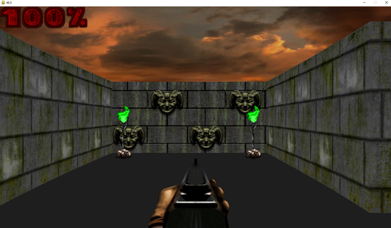
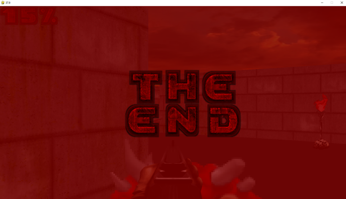

# FPS Game

A first-person shooter game inspired by the classic DOOM, built using Python and Pygame.
- By Kunal Chauhan and Madhav Ahuja

## Screenshots

### Start Screen


### End Screen


## Installation

1. Install dependencies:
   ```sh
   pip install -r requirements.txt
   ```

2. Run the game:
   ```sh
   python main.py
   ```

## Controls

- `WASD` - Move
- `Mouse` - Look around
- `Space` - Shoot

Enjoy the game!
